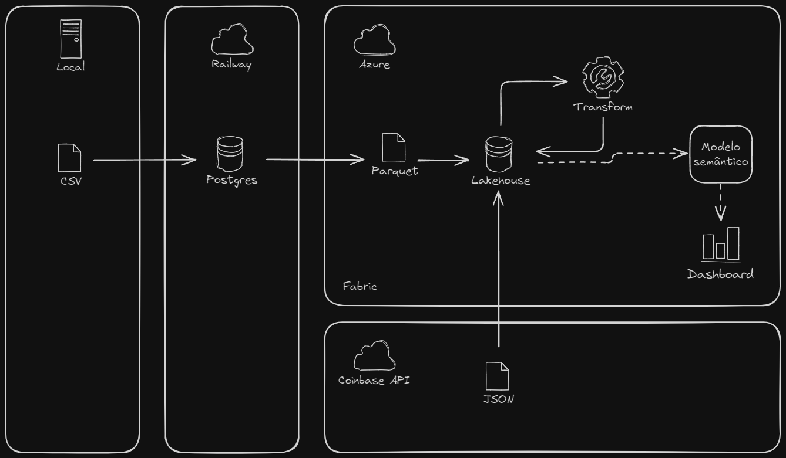

# Diagrama do projeto



# Criar uma conta trial no Fabric

## Portal Azure - Criando o usuário
- Com uma conta Microsoft pessoal, crie seu acesso no [portal Azure](https://portal.azure.com/#home)
- No portal Azure, [recomendo o uso em inglês](https://portal.azure.com/#settings), fica mais facil achar os elementos
- Procure por Microsoft Entra ID na busca
    - No menu lateral, clique em Manage -> Users
    - New user -> Create new user
    - Preencha os campos como desejar, e salve a senha!

## Solicitando o trial no Fabric
- Navegue até a página do [app do Fabric](https://app.fabric.microsoft.com/?pbi_source=learn-get-started-fabric-trial)
- Faça o login usando o email e senha criados anteriormente, ele é um email coorporativo
    - No primeiro login vai pedir para configurar o autenticador
- Após o login, clique no canto superior direito no Profile e procure a opção de iniciar o Trial (um botão verde)
- Ao clicar ali, vai inicar uma trial de 60 dias

---

# pgAdmin usando apenas Docker

## Build container
```bash
docker build -t my-pgadmin .
```
## Run Container
```bash
docker run -d --name pgadmin-container -p 8080:80 my-pgadmin
```

---
# pgAdmin usando Makefile

## Instalar o Make
### Linux (Ubuntu/Debian)
Atualize os pacotes:
```bash
sudo apt update
```

Instale o make:
```bash
sudo apt install make -y
```

### Linux (CentOS/Fedora/RHEL)
Instale o grupo de ferramentas de desenvolvimento:
```bash
sudo yum groupinstall "Development Tools"
```

### macOS
Instale o Xcode Command Line Tools (que inclui o make):
```bash
xcode-select --install
```

### Windows
- Baixar o Make for Windows no [link](https://gnuwin32.sourceforge.net/packages/make.htm)
- Adicionar o caminho de instalação no PATH (variável de ambiente)

## Comandos
### Construir a imagem:
```bash
make build
```

### Iniciar o container:
```bash
make start
```

### Parar o container:
```bash
make stop
```

### Remover o container:
```bash
make remove
```

### Reiniciar o container (rebuild):
```bash
make restart
```

### Ver logs do container:
```bash
make logs
```

### Acessar o shell do container:
```bash
make shell
```

### Limpar tudo (imagem e container):
```bash
make clean
```

---
# Instalar os pacotes

Com uv:
```bash
uv add pandas sqlalchemy python-dotenv psycopg2
```

Com pip:
```bash
pip install pandas sqlalchemy python-dotenv psycopg2
```

# Executar o upload_csv_to_postgres

Script vai enviar os arquivos csv locais para um banco Postgres apontado no arquivo `.env`
- Navegue até a pasta `upload_csv_to_postgres`
- Renomeie o arquivo `.env-example` para `.env` e preencha os dados necessários
- Execute o script `load_csv_to_postgres.py`
- Acompanhe o progresso no pgAdmin

---

# Voltando ao Fabric

## Criando uma pipeline Postgres -> lakehouse
Escolha com Base no Cenário:

- Dataflows Gen2: Para fluxos simples, baixa frequência de atualização.
- Data Pipelines: Para pipelines visuais e automação no Fabric.
- Notebooks (Spark): Para flexibilidade e transformações avançadas.
- Azure Data Factory: Para cargas massivas e arquiteturas híbridas.

Formato de Armazenamento:
- Sempre prefira o Delta Lake no Lakehouse, que oferece otimizações para consultas e integrações com Spark.

No exemplo, vamos usar o Data Pipeline.

### Data Pipeline
- No menu lateral, clique em Create
- Data Pipeline
- Se for a primeira source a ser adicionada no workspace, siga o tutorial
    - Selecione Postgres, e preencha os dados do banco e tabelas que deseja integrar
- Se não for a primeira source, será necessário mapear a source nova com o componente `Copy data`
- Aponte o destino para o lakehouse

## Criando uma tabela a partir de um arquivo e navegando na tabela
- Clique nos `...` do arquivo que deseja transformar em tabela e clique em Load to Tables -> New Table
- Troque para `SQL analytics endpoint` a visualização do ambiente
- Selecione `New SQL query`
    - Faça suas querys como desejar utilizando SQL
    - Teste as outras opções como `New visual query` e `New SQL query in notebook`

## Criando uma ingestão de dados de API
- No menu lateral, clique em Create
- Data Pipeline
- Use o `Copy data assistant`
- Digite `Http` na barra de busca e selecione essa source
- Na url coloque o endpoint de interesse, por exemplo `https://api.coinbase.com/v2/prices/BTC-USD/spot`
- Na proxima tela nao precisa configurar nada por enquanto, next
- Na tela do file format, ela demora alguns segundos para carregar. Altere para JSON, next.
- Destino utilize um lakehouse já criado 
- Salve como arquivo, especifique um path de pasta `raw_btcusd` por exemplo
- Nome do arquivo utilize variáveis de timestamp dinamicas, exemplo: `@utcNow()`
- Adicione um scheduler (aba Run no menu ao topo), por exemplo, a cada 15 min

## Criando etapas de transformação de dados

### Notebook Spark
- Crie um Notebook
    - Use o código exemplo fornecido na pasta `spark_notebook/transform_json_to_table.py` para obter os arquivos JSON do lakehouse e criar uma tabela Delta estruturada
    - Use o código com estratégia CDC (Change data capture) `spark_notebook/transform_json_to_table_cdc.py` para uma ingestão de dados mais eficiente
- Em outro Notebook, vamos criar um código para deduplicar os dados de ingestão da RAW em uma tabela Staging, use o código `spark_notebook/stg_bitcoin_prices.py`
- Adicione ambos os notebooks criados como etapas da pipeline de extração de dados criada anteriormente (isso vai executar os notebooks após a extração da API)

## Criando um Report no Power BI
- Abra o lakewarehouse
- No topo ao lado de Home, clique em Reporting -> New report
- Crie seu report no Power BI

